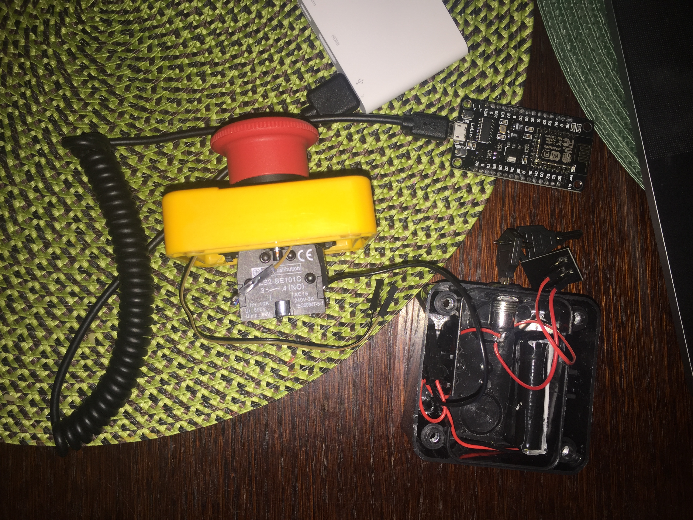

# Goal
The goal is to create a button that when pushed calls a configured http(s) url.
The idea of hardware setup was developed by my colleague - Aleksander Iwański. 

# How will it work?

The webhook button is powered up by a battery. When the webhook button is powered up WiFi is enabled. 
The button exposes following services:
- /wifi
   
   a html service that allows configuration of wifi connection to an access point.
- [GET] /webhook

    return current configuration of http(s) url address that is called when the button is pushed
    
- [POST] /webhook

    {
        url: `url address to be called`
        headers: [] `array of headers that are passed along the request`
        method: `valid http method like GET, POST, PUT, ...`
        payload: `a string that represents payload`
    } 

When the webhook button is pushed then it calls the configured url accordingly to the configuration

# Setup

For hardware we decided on:
* Arduino NodeMCU v3 (used to ease development of targeted ESP8266)
* ESP8266

Hardware without software is like an empty shell. To push some life into it, I've decided to use as base:
* [platformio](https://platformio.org) and
* [CLion](https://www.jetbrains.com/clion/).
        

   
## Preparation of the environment

1. Install platformio
   
    `brew install platformio` or `pip install -U platformio`
    
    In case of platformio was installed in version 4.0.x please upgrade to 4.1.x because of an issue that
    is corrected in 4.1.x
    Currently 4.1.x is under development, so an upgrade to development version is required: `platformio upgrade --dev`
    
1. Clone this project
    
    `git clone https://github.com/venth/webhook-button.git` 

1. Go to freshly created directory "webhook-button" and prepare project's for CLion

    Create project's directory and within the directory execute command:
    `platformio init --ide clion --board nodemcuv2` 

1. Compile project

    `platformio run`
    
1. Connect arduino to computer with USB port
1. Upload program

    `platformio run --target upload`
1. [Optional] reset arduino (stop blinking)
    
    Set `constant WORKING_PROGRAM   = false;`
    compile by `platformio run` and upload `platformio run --target upload`

# Daily things

* adding library
    * add entry in platformio.ini file to `lib_deps` property
    * update CLion project settings by executing command: `platformio init --ide clion --board nodemcuv2`
    
# Fighting diary

The first issue encountered during development was:
* failing tests - yeah, I wrote some, because wanted to check, whether the code works on the device

    ```
    Please wait...
    ar: no archive members specified
    usage:  ar -d [-TLsv] archive file ...
    ar -m [-TLsv] archive file ...
    ar -m [-abiTLsv] position archive file ...
    ar -p [-TLsv] archive [file ...]
    ar -q [-cTLsv] archive file ...
    ar -r [-cuTLsv] archive file ...
    ar -r [-abciuTLsv] position archive file ...
    ar -t [-TLsv] archive [file ...]
    ar -x [-ouTLsv] archive [file ...]
    *** [.pioenvs/native/lib0be/libEmbedded Template Library.a] Error 1
    In file included from .piolibdeps/WifiManager_ID567/WiFiManager.cpp:13:
    .piolibdeps/WifiManager_ID567/WiFiManager.h:16:10: fatal error: 'ESP8266WiFi.h' file not found
    #include <ESP8266WiFi.h>
    ```
    
    There are two issue in the aforementioned comment. First - `platformio' cannot create archive and 
    second - on the native platform we try to compile embedded library.
    
    To fix the first issue the code that contains references to embedded library is excluded in the native section of the platformio.ini file:
    `src_filter = +<*> -<main.cpp>` 
    
    The second issue is also corrected by change in the configuration. Adding `lib_archive = false` made platformio to omit
    archive creation.
    
The second one were related to template library I chose to ease my life and introduce pub/sub:
* [Embedded Template Library](https://www.etlcpp.com) compilation issues
    
    In the first approach `lib_deps =` section contained just the name of library, which caused installation of the most
    recently compiled library for the os. Unfortunately OSX compilation is quite old. To fix the issue installation
    by library name is replaced by installation by github repository url along with version (`https://github.com/ETLCPP/etl.git#14.26.7`).
    
    The next issue is caused by ecl_timer.c file. The fix is to use script executed before build that removes ecl_timer
    files. The script name: `clean_timer.py` and configuration in the platformio.ini: `extra_scripts = pre:clean_timer.py`
    
    Ambiguous stl functions issue was caused by wrongly prepared `etl_profile.h` file. Currently instead of using direct include of
    a specific profile just add `#define PROFILE_XXX`

The appeared that some libraries are not best choice for embedded development:
* `pio test -e nodemcuv2` ended up with unknown error

    The error: 
    ```
    ets Jan  8 2013,rst cause:2, boot mode:(3,6)
    load 0x4010f000, len 1384, room 16
    tail 8
    chksum 0x2d
    csum 0x2d
    v8b899c12
    ~ld
    ```
    
    To nail down the issue a test that only passes was used along with commented out code.
    By enabling small part of the code appeared that first couse was usage of: `#include <iostream>` 
    Removal of usage of the `iostream` made the test to pass.
    
    Searching continues.
    
    Now the issue looks like that:
    
    ```
    Exception (3):
    epc1=0x4021a780 epc2=0x00000000 epc3=0x00000000 excvaddr=0x40254930 depc=0x00000000
    >>>stack>>>
    ctx: cont
    sp: 3ffffbb0 end: 3fffffc0 offset: 01a0
    3ffffd50:  feefeffe feefeffe feefeffe 4021a889
    3ffffd60:  00000000 4020babb 00000050 40204b24
    3ffffd70:  feefeffe 3ffef930 00000007 4020bcf8
    3ffffd80:  00000000 00000000 feff00ff 402215bc
    3ffffd90:  00000001 00000006 4025493c 40254974
    3ffffda0:  00000001 feefeffe feefeffe 4021b1dc
    3ffffdb0:  feefeffe feefeffe feefeffe 4021b1fa
    3ffffdc0:  00000001 00000000 3ffef8a0 40254974
    3ffffdd0:  4025493c 00000000 3ffefea0 40223334
    3ffffde0:  3ffefea0 3ffffdf0 3ffef640 3ffef6e8
    3ffffdf0:  00000000 00000000 00000000 00000000
    3ffffe00:  00000000 feefeffe feefeffe 3ffef1cc
    3ffffe10:  00000010 3ffffeac 3ffffeac 3ffef1cc
    3ffffe20:  00000010 3fffff18 00000000 40214254
    3ffffe30:  3fff01c4 feefeffe 3ffffeac 40212a22
    3ffffe40:  feefeffe 00000000 3ffffeac 40212a70
    3ffffe50:  feefeffe 3ffffeac 3ffffe80 40212570
    3ffffe60:  feefeffe feefeffe 3ffffe80 40213047
    3ffffe70:  3fff1cac 00000000 00000000 4020273d
    3ffffe80:  3ffe8b1c feefeffe feefeffe feefeffe
    3ffffe90:  feefeffe feefeffe 3ffe85d0 3ffeef50
    3ffffea0:  05190699 0518e78a 40203394 3ffe8b30
    3ffffeb0:  00000006 00000000 00001002 00000000
    3ffffec0:  00000000 00000000 00000000 00000000
    3ffffed0:  00000000 00000000 00000000 00000000
    3ffffee0:  00000000 00000000 00000000 00000000
    3ffffef0:  00000000 00000000 00000000 00000000
    3fffff00:  00000000 00000000 00000000 00000000
    3fffff10:  00000008 3ffffed0 3fff01c4 00000000
    3fffff20:  00000000 00000000 00000000 00000000
    3fffff30:  00000000 00000000 3fff1c4c 40202983
    3fffff40:  00002580 3ffef0c0 3fff1c4c 402027a0
    3fffff50:  0001c200 0000001c 3fff1c4c 40201820
    3fffff60:  00002580 3ffef0c0 3ffeef50 402013ed
    3fffff70:  402017f0 3ffef1cc 3ffeef50 4020142c
    3fffff80:  4020397e 000003e8 3ffeef50 40201a23
    3fffff90:  feefeffe 3ffef0c0 3ffeef50 40201aae
    3fffffa0:  3fffdad0 00000000 3ffef19c 4020343c
    3fffffb0:  feefeffe feefeffe 3ffe85d0 40100bb1
    <<<stack<<<
    ets Jan  8 2013,rst cause:2, boot mode:(3,7)
    load 0x4010f000, len 1384, room 16
    tail 8
    chksum 0x2d
    csum 0x2d
    v8b899c12
    ~ld
    ```
    
    Nailing down the issue lead to `std::ostringstream` and `#include <sstream>`. The solution is
    to replace `sstream` with `combination of std::string and sprintf`.

Then when I came back to this project it appeared that platformio upgraded itselves to 4.0.x version and:
* `TypeError: 'set' object is not subscriptable` after I issued the command: `pio init --ide clion --board nodemcuv2`

    Solution of this issue was simply upgrade to dev version by command: `pio upgrade --dev` and now
    initialization just works.

# Appendix
## Lectures
* [Setup CLion and Arduino](https://www.instructables.com/id/Setup-JetBrains-Clion-for-Arduino-Development/)
* [Clion, Arduino and platformio combo setup](https://stuetzpunkt.wordpress.com/2017/06/26/a-first-program-with-esp8266esp-01-clion-and-platformio/)
* [Platformio Documentation](http://docs.platformio.org/en/stable/index.html)
* [Wifi Manager](https://github.com/tzapu/WiFiManager/wiki/API-reference)
* [aRest](https://github.com/marcoschwartz/aREST/blob/master/README.md)
* [ESP8266 HTTPClient examples](https://github.com/esp8266/Arduino/blob/master/libraries/ESP8266HTTPClient/examples/BasicHttpsClient/BasicHttpsClient.ino)
* [ESP8266 Decoding / Encoding JSON](https://randomnerdtutorials.com/decoding-and-encoding-json-with-arduino-or-esp8266/)
* [Why doesn't the built led work for Arduino NodeMCU v3](https://arduino.stackexchange.com/questions/38477/does-the-node-mcu-v3-lolin-not-have-a-builtin-led)
* [How do properly call a https call using ESP8266 HTTPClient](https://medium.com/@dfa_31434/doing-ssl-requests-on-esp8266-correctly-c1f60ad46f5e)
* [Embedded Template Library](https://www.etlcpp.com)
* [Arduino official documentation](https://www.arduino.cc/reference/en/language/functions/digital-io/digitalread/)
* [Nodemcu pinout](https://circuits4you.com/2017/12/31/nodemcu-pinout/)
